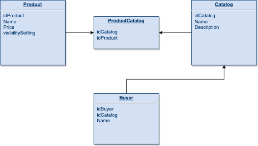

# Solution

### Problem description

_We have a system where products can be placed into catalogs and buyers are assigned to a
catalog. Products can have different visibility settings. If the setting is “default” then any buyer
can see the product. If the visibility is “catalog_members” then only buyers who are a member of
a catalog including the product can see it. A query for products on behalf of a buyer should
return any product that has visibility “default” OR the product exists in a catalog that includes
the buyer. A product has a name, price, and visibility setting._

**a) How would you model these relationships?**

I would like to define 4 tables, Product, ProductCatalog, Catalog and Buyer. 

Product is the table where the data related to products will be storage, nothing special just their attributes and the 
visibilitySetting field that will be useful when we want to retrieve products data.

ProductCatalog, this table is a many to many relationship, cause by this way we could have products in different catalogs 
without problems, his content is just the idCatalog and idProduct. 

Catalog is the table for catalogs data, nothing special.

Buyer, this will be the table for buyers, in this case I'm considering to add a foreign key pointing to Catalog table, by this 
way we could create the relation between buyers and catalogues, if a buyer just have access to one catalog it should 
works, but if a buyer could have been related with more than one catalog, a many to many relationship would be better.  

**b) How would you write a SQL query to return the list of products?**

TBH, I'm little rusty with pure SQL but my solution could be something like this:

`Select *
FROM product p, product catalog pc, catalog c, buyer b
WHERE 
p.visibilitysetting = ‘default’
OR (
p.idProduct = pc.IdProduct 
AND pc.idCatalog = c.idCatalog
AND c.idCatalog = b.idCatalog 
AND b.idBuyer = {idBuyer}
)`

In the previous query, {idBuyer} would be the Buyer id, inserting that value we could retrieve the product data 
related to one buyer.

